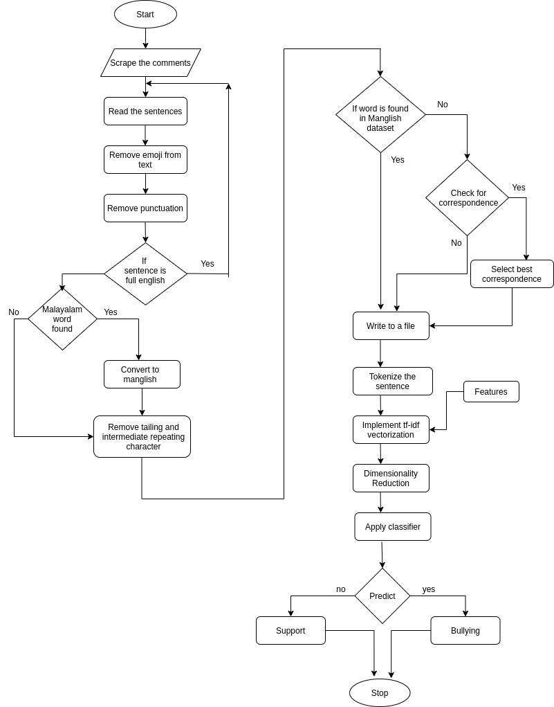
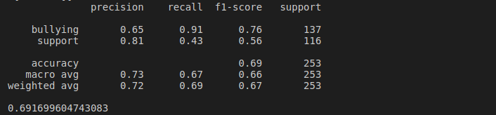

## Cyberbullying detection from Comments/Reviews

<h3> Overview </h3>

Machine learning can be used to detect cyberbullying from Comments/reviews. In this study, the focus is on identifying textual cyberbullying from social media using the comments under a post. Comments are scrapped with the help of the Selenium web driver. Using classification algorithms, it is possible to classify the comments as cyberbullying or supporting. Since it is a supervised machine learning task, datasets(comments) are manually labelled and these labelled datasets are used for training the classifier. By including suitable pre-processing techniques, many language barriers are overcome. The model is trained to detect the custom features from Malayalam and English transliteration of Malayalam language (Indian regional language). Applying ML on regional languages is always a great task, Cyberbullying detection on the Malayalam language is a unique one. The model is trained with various algorithms like Random Forest, XGBoost, SVM and choose the one which produces more accuracy.

<h3> To run the project: </h3>

- pip install -r requirements.txt

- insta.py: It helps to scrap the comments from Instagram. Replace the URL of your wish to start scrapping (Note: Use the only posts belongs to Malayalam community)

- filtering.py: This helps to remove emoji’s, stopwords, punctuations, removing English sentences etc. (to run: python3 filtering.py) it starts to filter the scrapped comment dataset from the data folder

- preprocessing.py: This helps to correct the spelling of the words in the sentences from the filtered comments. (to run: python3 preprocessing.py)

- svm_with_dia_reduction.py: Classification part
 (to run: python3 svm_with_dia_reduction.py)

- More different classification approach present in classifier folder like Random Forest, XGBoost. To run those paste them outside the classifier folder.

- Testing folder includes the unit testing. To run those paste them outside the testing folder.

<h3> Block Diagram </h3>

##### This project is tested with social media comments based on Malayalam language (Indian regional language)
.png)

<h3> Working </h3>

Initially, the comments are scraped from the Instagram. Then in the filter process the emojis, symbols, repeating tailing letters, handle tags, completely English comments are removed. The Malayalam is transliterated to English.  The transliterated words are then converted to a uniform spelling by passing the comments though an English-transliteration spellchecker using the Levenshtein algorithm.  Two datasets are created, one for bullying comments and the other for support comments. Data sampling is done to increase the size of the datasets. The comments are vectorized using Tfidf Vectorizer using custom features. The dimensionality of the features are reduced using Latent Semantic Analysis. The classifier is trained using the vectorised comments. The accuracy of the classifier is determined.

<h3> Dataset </h3>

##### Support  and  Bullying  Dataset:  
This Dataset contains preprocessed comments in which supporting comments are labelled as support and bullying comments as bullying. The comments are obtained by scraping from the Instagram posts using Selenium WebDriver. This contains raw data because the comments in this dataset are not processed for classification.  It includes Malayalam,  English and  Manglish comments. Each comment may also include noises like emojis, punctuations etc. and orthographical errors which need to be processed. So after preprocessing and transliteration each comment is manually tagged as support or bullying depending on the nature of the comment.

<h3> About classifier </h3>

##### For this project i have used SVM (Support Vector Machine) classifier because that gives me a better accuracy.

<h3> Scope Of Project </h3>

This is a project which has massive scope in ensuring a better internet experience for humans. The worldwide web is a deep ocean filled with all types of metaphorical ”flora” and ”fauna”. In this day and age where the internet has become an integral part of our lives, this project has massive untapped potential.

This project’s scope includes :
1.  Ability to aid in the minimization of cyberbullying through accurate detection of comments implying ”cyberbullying”.
2.  Can aid in obtaining the demographic of online bullies. This can once again help streamline the pursuit to thwart online bullying.

